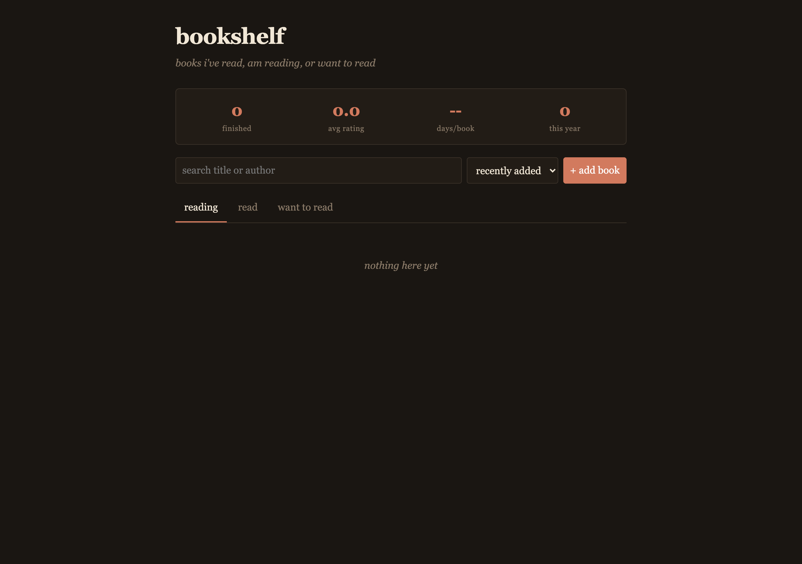

# bookshelf



A small reading log. I kept losing track of which books I'd actually finished
versus the pile I keep meaning to start, so I built this. Three tabs: reading,
read, want to read. Add a book, give it a rating when you're done, jot a note.
Everything stays in localStorage.

## What it does

- add/edit/delete books with title, author, year, status, started/finished dates, rating, notes
- three tabs (reading, read, want to read)
- search across title and author
- sort by recently added, finished date, rating, or title
- shows total finished, average rating, books finished this year
- shows a "pace" number in days/book based on the time between your first and last finished book

## The pace number

Pace is just `days / books`. It takes the span between your earliest and latest
finished book in days and divides by the number of finished books with a
finish date. Needs at least two finished books to show. Not perfect math, but
it gives a useful gut feel for whether the year is going faster or slower than
the last one.

## Run it

No build step, just open the file.

```
git clone https://github.com/secanakbulut/bookshelf.git
cd bookshelf
open index.html
```

Or `python -m http.server` if your browser is fussy about file:// URLs.

## Stack

Plain HTML, CSS, and JS. No dependencies. Data lives in localStorage under the
key `bookshelf.v1`.

## License

PolyForm Noncommercial 1.0.0, see LICENSE. Free for personal use, not for resale.
